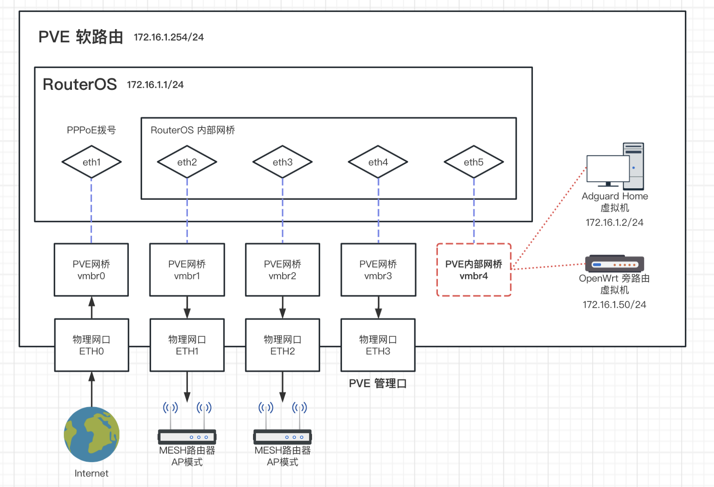
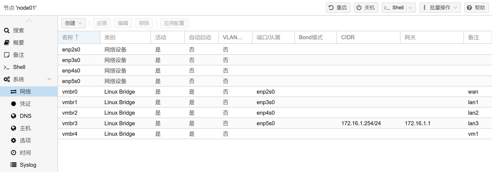
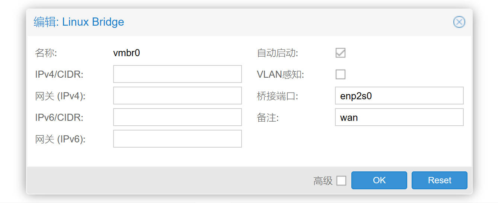
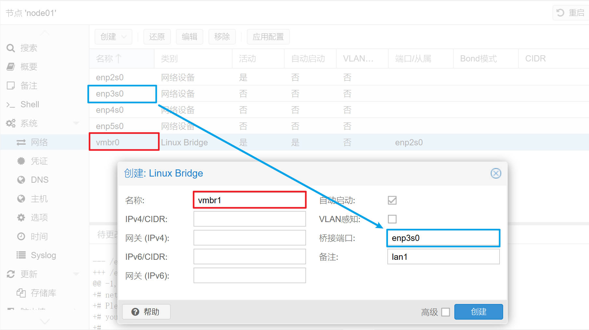
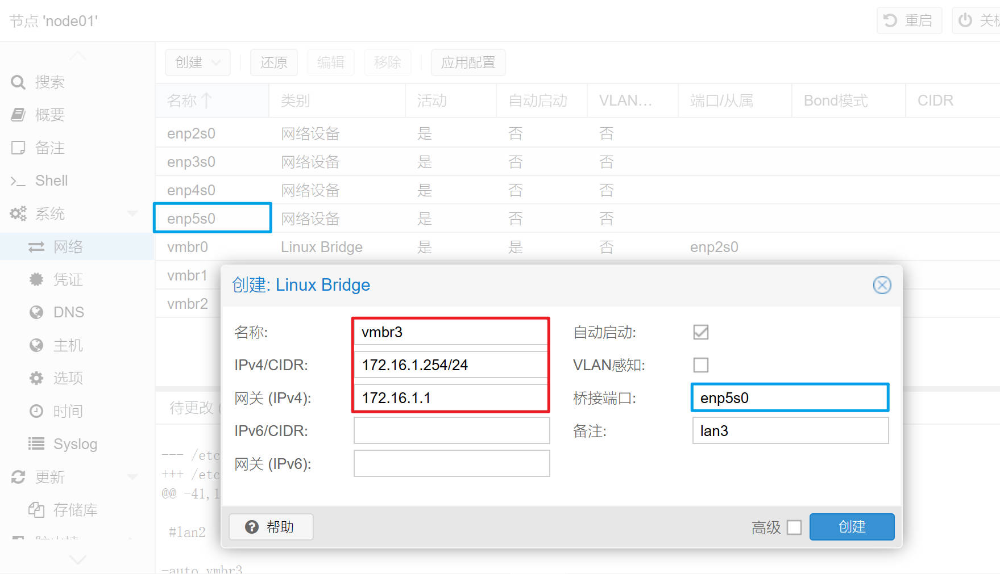
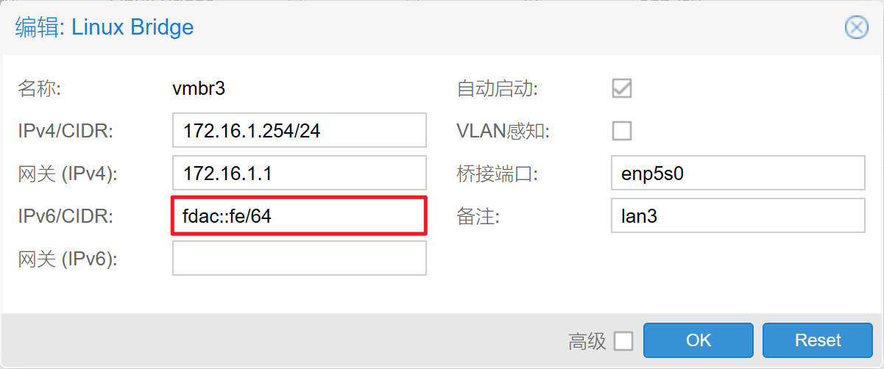
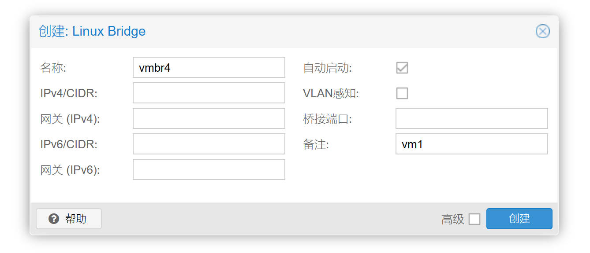
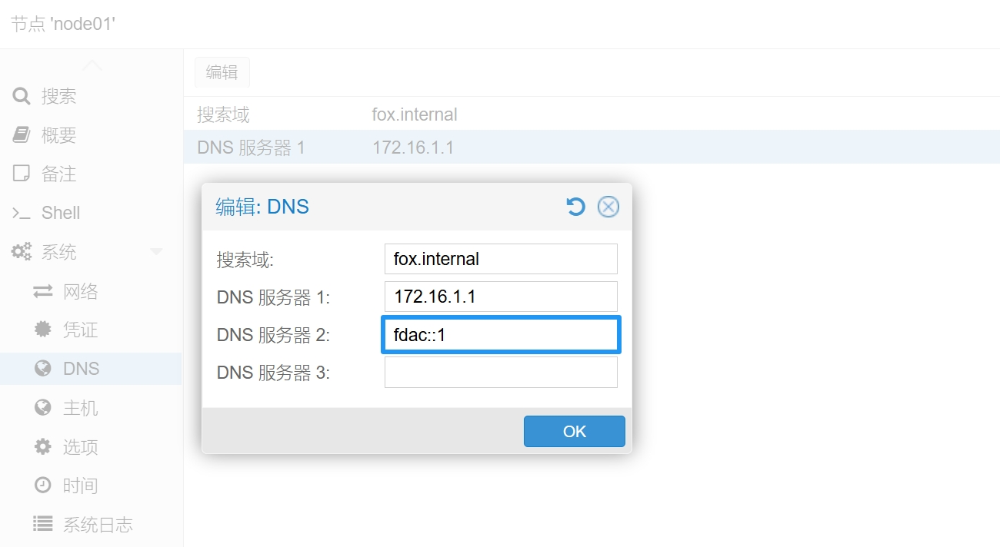

## 1.更换软件源

在上一篇文章 [01.PVE系统安装](./01.PVE系统安装.md) 中，从刚装好的 PVE 系统中获取了系统的一些参数。  


此处显示出 PVE 底层使用的是 Debian 的系统，代号为 `bookworm` 。  

为了后续能对 PVE 系统进行升级，需要更换其镜像仓库，也就是大家熟知的软件源。  

由于目前处于 **“离线”** 安装状态，因此更换完软件源后，在没有网络的情况下无法对系统更新。  

### 1.1.系统软件源

使用终端工具登录到 PVE 服务器，首先对现有的软件源配置进行备份。  

```bash
## 进入系统软件源配置目录
$ cd /etc/apt

## 查看系统默认镜像配置
$ cat sources.list

## 将默认软件源配置文件进行备份
$ cp sources.list sources.list.bak
```

系统默认镜像配置记录如下。  

```bash
deb http://ftp.debian.org/debian bookworm main contrib

deb http://ftp.debian.org/debian bookworm-updates main contrib

# security updates
deb http://security.debian.org bookworm-security main contrib
```

这里我将使用 [中国科技大（USTC）](http://mirrors.ustc.edu.cn/help/proxmox.html) 的镜像仓库进行替换，使用如下命令。  

**注意：该命令为两行，在输入时请逐行输入并回车执行。**  

```bash
## 替换系统软件仓库

$ sed -i 's|^deb http://ftp.debian.org|deb https://mirrors.ustc.edu.cn|g' /etc/apt/sources.list

$ sed -i 's|^deb http://security.debian.org|deb https://mirrors.ustc.edu.cn/debian-security|g' /etc/apt/sources.list

```

如果希望能更新 CPU 的 `microcode` ，则需要手动添加镜像 `non-free` 、 `non-free-firmware` 参数，完整系统源示例如下。  

```bash
deb https://mirrors.ustc.edu.cn/debian/ bookworm main contrib non-free non-free-firmware

deb https://mirrors.ustc.edu.cn/debian/ bookworm-updates main contrib non-free non-free-firmware

# security updates
deb https://mirrors.ustc.edu.cn/debian-security/ bookworm-security main contrib non-free non-free-firmware
```

### 1.2. PVE 软件源

默认情况下，PVE 额外启用了 2 个官方源，且为订阅收费制，因此需要替换为免费源。  

首先创建 PVE 免费软件源，执行以下命令。  

```bash
## 创建 PVE 免费软件源

$ source /etc/os-release

$ echo "deb https://mirrors.ustc.edu.cn/proxmox/debian/pve $VERSION_CODENAME pve-no-subscription" > /etc/apt/sources.list.d/pve-no-subscription.list
```

对于 Proxmox Backup Server 和 Proxmox Mail Gateway，请将以上命令中的 `pve` 分别替换为 `pbs` 和 `pmg` 。  

进一步创建 PVE Ceph 免费软件源，Ceph 软件源为 PVE 8 之后默认安装，执行以下命令。  

```bash
## 创建 PVE Ceph 免费软件源脚本

if [ -f /etc/apt/sources.list.d/ceph.list ]; then
  CEPH_CODENAME=`ceph -v | grep ceph | awk '{print $(NF-1)}'`
  source /etc/os-release
  echo "deb https://mirrors.ustc.edu.cn/proxmox/debian/ceph-$CEPH_CODENAME $VERSION_CODENAME no-subscription" > /etc/apt/sources.list.d/ceph-no-subscription.list
fi
```

最后，删除 PVE 官方付费软件源，执行以下命令。  

**注意：rm 为高风险命令，请正确使用，请勿手抖，请勿手抖。**

```bash
## 删除付费软件源
$ rm -rvf /etc/apt/sources.list.d/pve-enterprise.list /etc/apt/sources.list.d/ceph.list
```

创建完成后对其进行检查。  

```bash
## 检查 PVE 免费源

$ cat /etc/apt/sources.list.d/pve-no-subscription.list

$ cat /etc/apt/sources.list.d/ceph-no-subscription.list
```

如果输出结果中有 USTC 的镜像地址，则表示命令已经正确执行。  

```bash
#### PVE 免费软件源示例输出

#### PVE
deb https://mirrors.ustc.edu.cn/proxmox/debian/pve bookworm pve-no-subscription

#### Ceph
deb https://mirrors.ustc.edu.cn/proxmox/debian/ceph-quincy bookworm no-subscription
```

### 1.3. PVE CT 源

如果需要使用 Proxmox 网页端下载 CT Templates ，可替换 CT Templates 源。  

由于该功能暂时未被使用，因此本文只做记录。  

```bash
## 备份 CT Templates 源
$ cp /usr/share/perl5/PVE/APLInfo.pm /usr/share/perl5/PVE/APLInfo.pm.bak

## 替换 CT Templates 链接
$ sed -i 's|http://download.proxmox.com|https://mirrors.ustc.edu.cn/proxmox|g' /usr/share/perl5/PVE/APLInfo.pm

## 重启 PVE API 守护进程
$ systemctl restart pvedaemon.service

## 更新 CT Templates 列表
$ pveam update
```

### 1.4.镜像同步

更换完成系统源之后，需要同步系统源数据。  

考虑到 **“离线”** 安装时无法同步系统源，因此该步骤可以等到 PVE 正确连接 Internet 后再执行。  

```bash
## 清理软件包
$ apt clean && apt autoclean && apt autoremove --purge

## 同步软件源
$ apt update

## 更新系统
$ apt full-upgrade
```

## 2.安装必要软件

安装软件前，同样需要让 PVE 能够访问外网。  

安装 `iperf3` 后，系统将询问是否将其作为系统服务开机自启，选择 `no` 即可。  

其中 `unattended-upgrades` 为系统自动更新服务，后续会对其进行配置。  

`linux-cpupower` 为 CPU 调度器的配置工具，后续会对 CPU 调度算法进行调整。  

```bash
## 同步镜像仓库
$ apt update

## 安装系统软件
$ apt install btop lm-sensors unzip neovim tmux unattended-upgrades powermgmt-base

## 安装网络工具
$ apt install iperf iperf3 iftop sshguard openvswitch-switch

## 安装 CPU 调度调整工具
$ apt install linux-cpupower

## 根据 CPU 厂商安装 CPU 微码工具
$ apt install intel-microcode (amd64-microcode)

## 更新 PCI 数据库
$ update-pciids
```

## 3.配置 PVE 网络

设置电脑的 IPv4 地址为静态地址，电脑 IPv4 地址段需要与 PVE 的地址段保持一致。  

用网线将电脑的网口与 PVE 的管理网口，此时应该为编号最小的第一个网口，相连接。  

访问 PVE 的 WEB 管理界面，对 PVE 的网络进行一些调整。  

根据 **网络设备** 规划， PVE 中虚拟机规划如下。  

|系统|作用|说明|
|--|--|--|
|RouterOS|主路由|PPPoE 拨号上网|
|Debian12|Linux 服务器|内网 DNS 服务器|
|OpenWrt|旁路由|内网插件服务|

根据 **内部网络地址** 规划，PVE IP 地址规划如下。  

|地址类型|作用|值|说明|
|--|--|--|--|
|IPv4|管理地址|`172.16.1.254`|PVE IPv4 地址|
||网关地址|`172.16.1.1`|PVE IPv4 网关|
||DNS 地址|`172.16.1.1`|PVE IPv4 DNS 服务器|
|IPv6|管理地址|`fdac::fe`|PVE IPv6 地址（可选）|
||网关地址|`-`|IPv6 网关将使用 `SLAAC` 自动配置|
||DNS 地址|`fdac::1`|PVE IPv6 DNS 服务器（可选）|



初次登录 PVE 的 WEB 管理后台，打开网络管理页面，此时只有一个 `vmbr0` 。  

该 `vmbr0` 与列表中的第一个物理网口绑定，且在 `CIDR` 和 `网关` 处有 IP 地址参数，说明 `vmbr0` 为当前管理网口。  


接下来将修改 PVE 网络配置，在修改完成前， **请不要点击 “应用配置”** ，否则会导致 PVE 无法访问。  

在 PVE 内部网络设置完成后，将如图所示。  



### 3.1.修改 vmbr0

鼠标双击 `vmbr0` ，进入网桥配置界面。  

删除 `IPv4/CIDR` 和 `网关` 信息，确保 `自动启动` 为勾选状态。  

在备注处填写 `wan` ，然后点击 `OK` 按钮。  



### 3.2.创建网桥

点击左上角的 `创建` 按钮，选择 `Linux Bridge` ：  


因为 `vmbr0` 名称已被使用，因此名称填写 `vmbr1` 。  

桥接端口填写顺序的第二个网卡名称，演示中为 `enp3s0` 。  

确保 `自动启动` 为勾选状态，在备注处填写 `lan1` ，点击 `创建` 按钮。  

然后，依次创建所有物理接口的内部网桥，直到最后一个网桥，即 PVE 的管理网口。  



### 3.3.创建管理网口

在创建最后一个物理网口的网桥时，需要额外配置 `IPv4` 地址和对应的 `网关` 参数。  



额外说明：  

1. 如非特殊需求，通常情况下 PVE 系统无需使用 IPv6 网络。  

2. 主路由未配置 IPv6 ULA 网段时，例如本文演示地址 `fdac::/64` ，无需填写 `IPv6/CIDR` 参数。  

3. 通常情况下 IPv6 无需填写 `网关` 参数，IPv6 网关将通过 LLA IPv6 地址自动配置。  



在所有物理网口的 PVE 网桥创建完成后，可以点击 `应用配置` 按钮，此时页面会失去连接。  

无需担心，只需要将电脑的网线从 PVE 物理机的第一个网口拔出，并插入到最后一个网口即可。  

如果万一还是无法访问到 PVE，可以尝试使用网线 “拔插” 方法，挨个测试 PVE 网口的访问情况。  

### 3.4.创建内部网桥

纯内部网桥，在没有内部路由系统提供额外桥接的情况下，无法直接通过物理网口进行访问。  

只有在主路由（例如 RouterOS ）安装完成并建立了内部网桥后，才可正常使用。  

该纯内部网桥，其主要作用是通过 **主路由** 给内部其他虚拟机提供 **统一** 的网络访问接口。  

创建纯内部网桥的方法，与创建物理网口网桥的方法基本一致，唯一区别是 `桥接端口` 参数为 **空** 即可。  



当然，内部网桥的作用不仅如此，比如还可以作为内部级联路由的连接器。  

例如，安装了 OPNsense 和 RouterOS 两个虚拟机，OPNsense 作为网关防火墙使用。  

此时 RouterOS 作为二级路由系统，OPNsense 的 LAN 口需要与 RouterOS 的 WAN 口相连。  

如果 OPNsense 和 RouterOS 均使用了绑定物理网口的 PVE 网桥，则需用网线在 PVE 服务器上连接两个物理网口。  

浪费了宝贵的网线不说，还占用了网口，得不偿失。  

而纯内部网桥则能很好的解决该问题，有了纯内部网桥，不论多少个虚拟机使用该网桥，只要 IP 地址段相同，即可相互访问。  

## 4.配置 PVE DNS

在 PVE 系统的安装过程中，设置了 DNS 的 IPv4 地址 `172.16.1.1` ，但并未设置 DNS 的 IPv6 地址。  

在 PVE 的 DNS 设置页面，手动添加 DNS IPv6 地址，即主路由 LAN 口 IPv6 ULA 地址。  

同样，若 PVE 不使用 IPv6 网络或主路由未配置 IPv6 ULA 网段，本步骤可跳过。  



至此，PVE 的初始化配置完成。  

