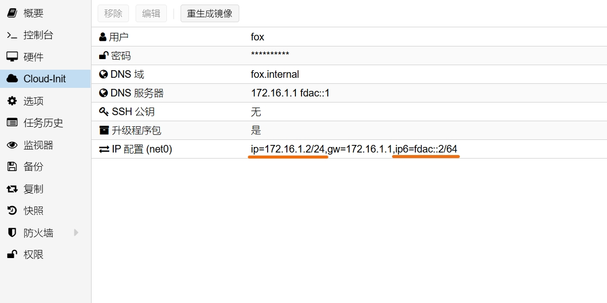
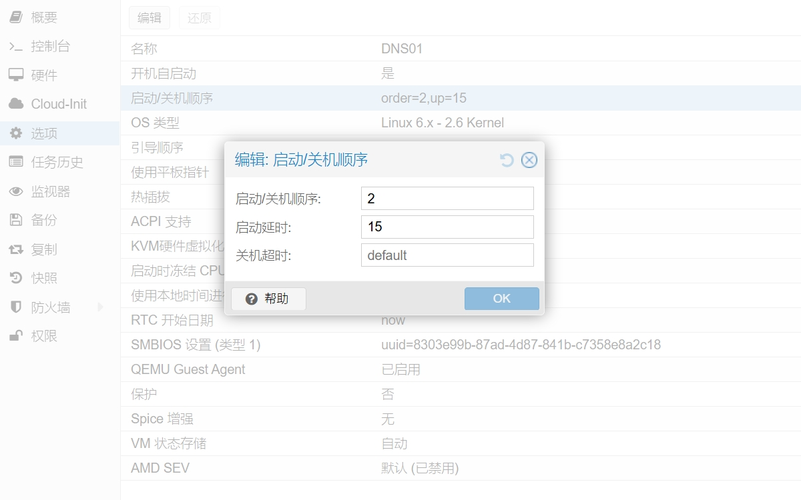

## 1.克隆虚拟机

在上一篇文章 [05.PVE制作虚拟机模板](./05.PVE制作虚拟机模板.md) 中，已经制作好了虚拟机模板。  

接下来将使用该模板克隆出新的虚拟机，并安装 Adguard Home 作为内网的 DNS 服务器。  

鼠标 **右键单击** 虚拟机模板，在弹出的菜单中选择 `克隆` 。  


在弹出的虚拟机克隆对话框中，根据实际情况及下方表格内容，修改虚拟机参数。  

|参数|值|说明|
|--|--|--|
|目标节点|`node01`|当前 PVE 服务器节点|
|VM ID|`201`|可自定义，不能与现存虚拟机 `VM ID` 相同|
|名称|`DNS01`|可自定义，`Cloud-Init` 将使用该名称作为虚拟机 `hostname` |
|模式|`完整克隆`|选择虚拟机的克隆模式|
|目标存储|`local-lvm`|克隆出的虚拟机文件存储位置|

修改参数后，点击 `克隆` ，即可使用该模板克隆出新的虚拟机。  


## 2.调整 Cloud-Init

克隆出来的虚拟机的 `Cloud-Init` 参数默认与模板完全一致。  

根据 **内部网络地址** 规划，内网 DNS 服务器 IP 地址分别为：  

- `172.16.1.2/24 (fdac::2/64)`  

- `172.16.1.3/24 (fdac::3/64)`  

因此需要调整新虚拟机的 `Cloud-Init` 参数。  

- `IP配置` 中的 IPv4 地址参数为 `172.16.1.2/24` ，网关保持 `172.16.1.1` 不变。

- `IP配置` 中的 IPv6 地址参数为 `fdac::2/64` ，网关保持为空。

需要注意的是，如果修改了 `用户` 参数，相当于新建了一个系统管理员，之前设置的 `oh-my-zsh` 需要在新管理员下重新设置。  


当主路由配置了 ULA IPv6 网段，且指定了内网 DNS 服务器的 ULA IPv6 地址时，参数如下。  



## 3.调整配置参数

在 [04.PVE创建模板虚拟机](./04.PVE创建模板虚拟机.md) 中提到过，新虚拟机需要修改配置参数才能自动启动。  

进入左侧虚拟机 `选项` 页面，将虚拟机 `开机自启动` 参数设置为 `是` 。  


鼠标 **双击** `启动/关机顺序` 选项，可调整虚拟机的自动开机参数。  

`启动/关机顺序` 为 `2` ，表示该虚拟机第 `2` 个启动，倒数第 `2` 个关机。  

`启动延时` 为 `10` ，表示该虚拟机在 PVE 启动后，延迟 `10` 秒后自动启动。  



## 4.调整系统端口

设置完成后，将该虚拟机开机，并使用 SSH 工具登录。  

Adguard Home 需监听系统 `53` 端口来提供 DNS 服务，使用以下命令检查端口占用。  

```bash
## 检查 53 端口占用
$ sudo lsof -i :53

#### 端口占用示例输出
COMMAND   PID            USER   FD   TYPE DEVICE SIZE/OFF NODE NAME
systemd-r 347 systemd-resolve   17u  IPv4  13445      0t0  UDP localhost:domain
systemd-r 347 systemd-resolve   18u  IPv4  13446      0t0  TCP localhost:domain (LISTEN)
systemd-r 347 systemd-resolve   19u  IPv4  13447      0t0  UDP localhost:domain
systemd-r 347 systemd-resolve   20u  IPv4  13448      0t0  TCP localhost:domain (LISTEN)
```

当前系统 `53` 端口被 `systemd-resolved.service` 占用，会导致 Adguard Home 监听端口失败。  

为了正常使用 Adguard Home ，需要对 `systemd-resolved.service` 进行配置，逐行执行以下命令。  

```bash
## 创建 systemd-resolved 配置文件夹
$ sudo mkdir -p /etc/systemd/resolved.conf.d

## 创建 systemd-resolved 配置文件
$ sudo vim /etc/systemd/resolved.conf.d/adguardhome.conf
```

在配置文件中添加以下配置项，并保存。  

```bash
## systemd-resolved 配置项

[Resolve]
DNS=127.0.0.1
DNSStubListener=no

```

保存该配置文件后，还需调整系统 `resolv.conf` 配置文件，逐行执行以下命令。  

```bash
## 备份 resolv.conf 配置文件
$ sudo mv /etc/resolv.conf /etc/resolv.conf.bak

## 创建 resolv.conf 软链接
$ sudo ln -s /run/systemd/resolve/resolv.conf /etc/resolv.conf
```

配置完成后，需重启 `systemd-resolved.service` 服务，并再次检查系统 `53` 端口占用。  

```bash
## 重启 systemd-resolved 服务
$ sudo systemctl restart systemd-resolved.service
```

## 5.安装 Adguard Home

Adguard Home 将采用 `snap` 形式安装，逐行执行以下命令。  

```bash
## 安装 snap
$ sudo apt install snapd

## 安装 Adguard Home
$ sudo snap install adguard-home
```

### 5.1. Snap 自动更新

查看 Snap 当前的更新策略，执行以下命令。  

```bash
## 显示当前 Snap 自动更新设置
$ sudo snap refresh --time
```

将 Snap 自动更新时间设置为每天 `2:30-3:30` 和 `14:30-15:30` 两个时间段。  

```bash
## 修改 Snap 自动更新时间
$ sudo snap set system refresh.timer=2:30-3:30,14:30-15:30

## 其他 Snap 自动更新时间设置语法参考
$ sudo snap set system refresh.timer=mon,2:30,,fri,2:30
```

### 5.2. Snap 定时任务

本步骤为可选操作，主要设置定时重启 Snap 服务。  

```bash
## 查看系统定时任务
$ sudo crontab -l

## 编辑系统定时任务，编辑器选择 nano
$ sudo crontab -e
```

在配置文件末尾，增加以下配置项。  

```bash
## 定时任务配置项

0 5 * * * /usr/bin/snap restart adguard-home

```

## 6.配置 Adguard Home

关于 Adguard Home 配置相关内容，请参阅 [Adguard Home 折腾手记](https://gitee.com/callmer/agh_toss_notes) 。  

至此，新虚拟机已配置完成，可作为内网 DNS 服务器使用。  

