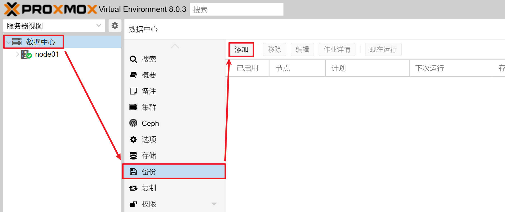
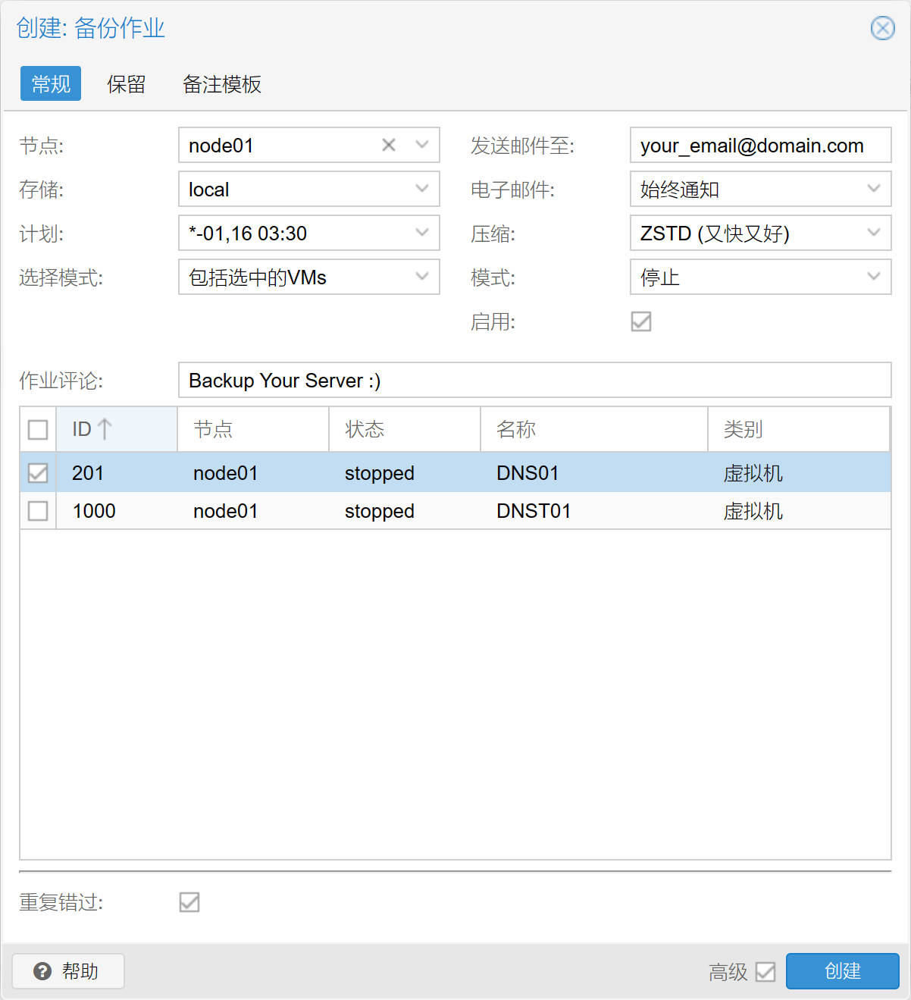
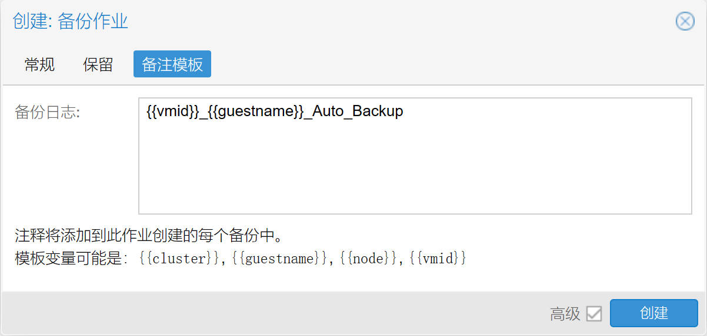

## 1.添加备份作业

在所有虚拟机创建并配置完成后，可以使用 PVE 自带的备份功能周期性的将虚拟机备份。  

点击 PVE 的 `数据中心` ，在右侧菜单中选择 `备份` 功能。  

点击顶部 `添加` 按钮，添加一个 `备份作业` 。  

### 1.1.常规选项

在弹出的 `创建：备份作业` 对话框中，勾选底部 `高级` 选项，`备份作业` 的各项参数如下。  

|参数|值|说明|
|--|--|--|
|节点|`node01`|选择当前 PVE 服务器节点|
|存储|`local`|选择存放备份文件的路径|
|计划|`*-01,16 03:30`|`备份作业` 执行的时间计划|
|选择模式|`包括选中的VMs`|执行备份的虚拟机对象|
|发送邮箱至|`your_email@domain.com`|`备份作业` 邮件的收件人邮箱|
|电子邮件|`始终通知`|何时发送 `备份作业` 邮件提醒|
|压缩|`ZSTD`|选择备份文件的压缩算法|
|模式|`停止`|选择备份虚拟机的方式，推荐使用 `停止` |
|启用|**勾选**|表示该 `备份作业` 为启用状态|
|作业评论|`Backup Your Server :)`|`备份作业` 的备注信息，使用英文输入|
|重复错过|**勾选**|表示当意外错过备份执行时间后，将重试备份|

**额外说明：**  

1. 计划中的 `*-01,16 03:30` 表示每个月的 1、16 日凌晨 03:30 进行备份。  

2. `备份作业` 在正确配置收件人邮箱之前，并不能发出邮件。  

3. `停止` 模式表示备份时会将虚拟机置于关机状态，备份完成后再恢复至之前的状态。  

4. 虚拟机列表中，勾选 `备份作业` 需要备份的虚拟机（可多选）。  

### 1.2.保留选项

该选项将控制备份文件的保留个数，选择保留最近 `3` 份备份文件。  

### 1.3.日志模板

该选项将按照设置的内容，自动重命名备份文件。  

在 `备份日志` 右侧文本框中输入 `{{vmid}}_{{guestname}}_Auto_Backup` 。  

点击 `创建` 按钮，`备份作业` 创建完成。  

## 2.调度模拟器

在创建完成 `备份作业` 后，可以使用 `调度模拟器` 来模拟 `备份作业` 的执行时间。  

鼠标 **单击** 选中一个 `备份作业` ，点击右上角的 `调度模拟器` 。  

`计划` 处将显示 `备份作业` 的执行时间参数，点击 `模拟` 按钮，在右侧将显示模拟的时间结果。  

确认 `备份作业` 的执行时间周期是否符合预期。  

至此，虚拟机的自动备份已配置完成。  

