## 0.前期准备

将虚拟机制作成模板，可以在后续新建虚拟机时快速从模板中创建，减少系统安装配置时间。  

本文将使用 Debian 的云镜像 `debian-11-genericcloud-amd64.qcow2` 作为模板虚拟机的镜像。  

访问 [Debian Official Cloud Images](https://cloud.debian.org/images/cloud/) 官方网站，下载最新版 `Bullseye` 云镜像以及对应的校验文件：

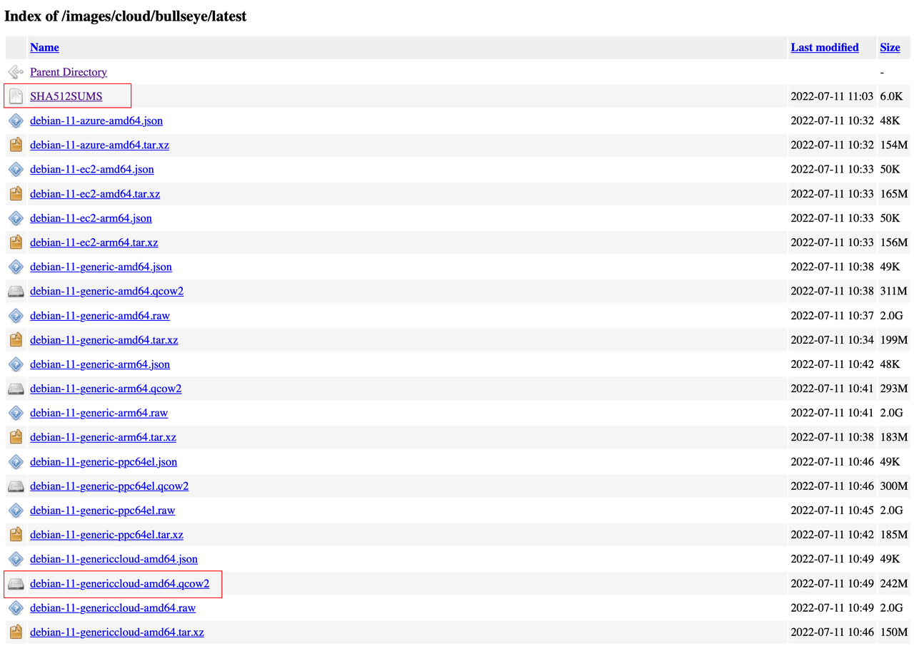

该虚拟机模板主要作为内网 DNS 服务器使用，并会安装 Adguard Home 。

## 1.创建虚拟机

### 1.1.常规

登录到 PVE 后台后，进入新建虚拟机流程，并勾选底部 “高级” ，打开虚拟机创建页面的高级选项。

节点即本机，`VM ID` 和 `名称` 可以自由定义。

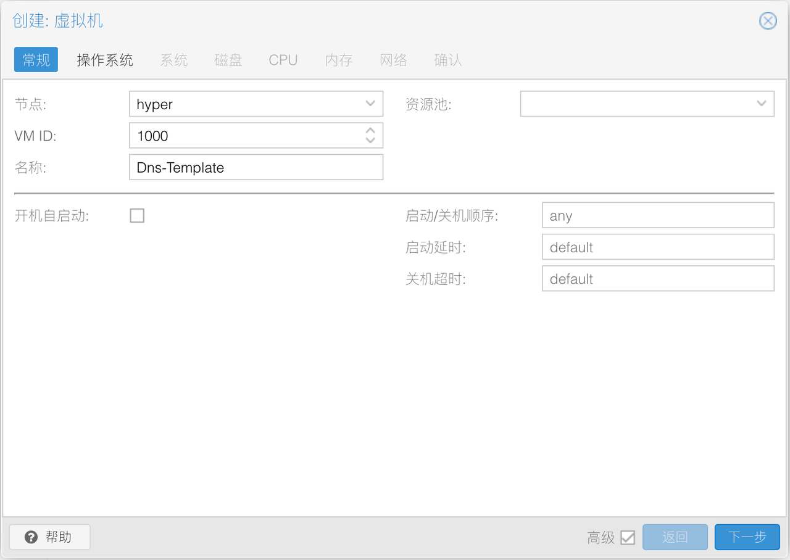

### 1.2.操作系统

无需使用任何安装介质。  

操作系统类别选择 `Linux` 、版本选择 `5.x - 2.6 Kernel` 即可。

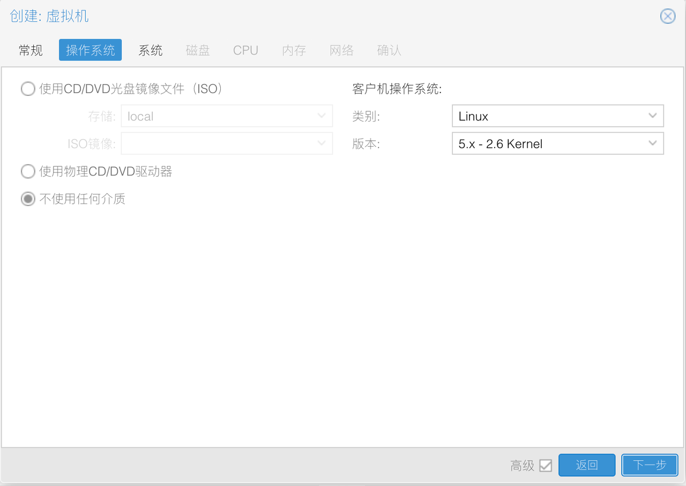

### 1.3.系统

系统部分需要修改一些内容，以满足 Debian 使用 `UEFI` 启动需求。  

显卡选择 `默认`，图中使用的 `SPICE` 仅供测试。  

机型一般选择 `默认` 即可，使用 `q35` 主要为了测试 `UEFI` 启动。  

SCSI 控制器选择 `VirtIO SCSI single` ，勾选 `Qemu代理` 选项。  

在固件处需要针对 `UEFI` 进行调整，BIOS 选择 `OVMF (UEFI)` ，勾选 `添加EFI磁盘` ，EFI 存储选择 `local-lvm` ：

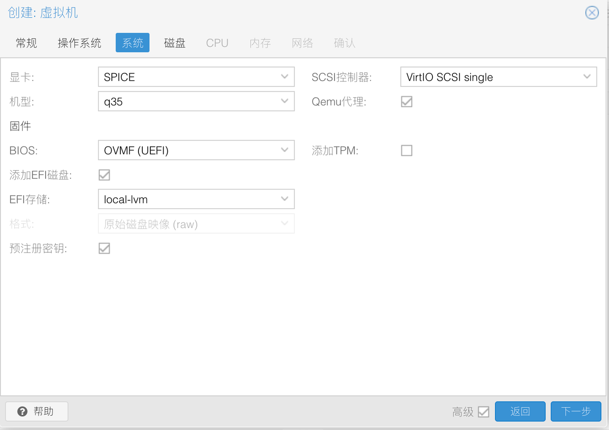

### 1.4.磁盘

一般情况下，如果该虚拟机仅为 ADH 服务器，`16G` 的磁盘空间足够使用。  

由于使用 Cloud Image 制作虚拟机模板，此处删除所有磁盘：


### 1.5.CPU

CPU类别选择 `host` ，核心根据物理 CPU 核心数进行酌情设置。  

若 PVE 服务器内有多颗物理 CPU ，则推荐启用 `NUMA` ：  

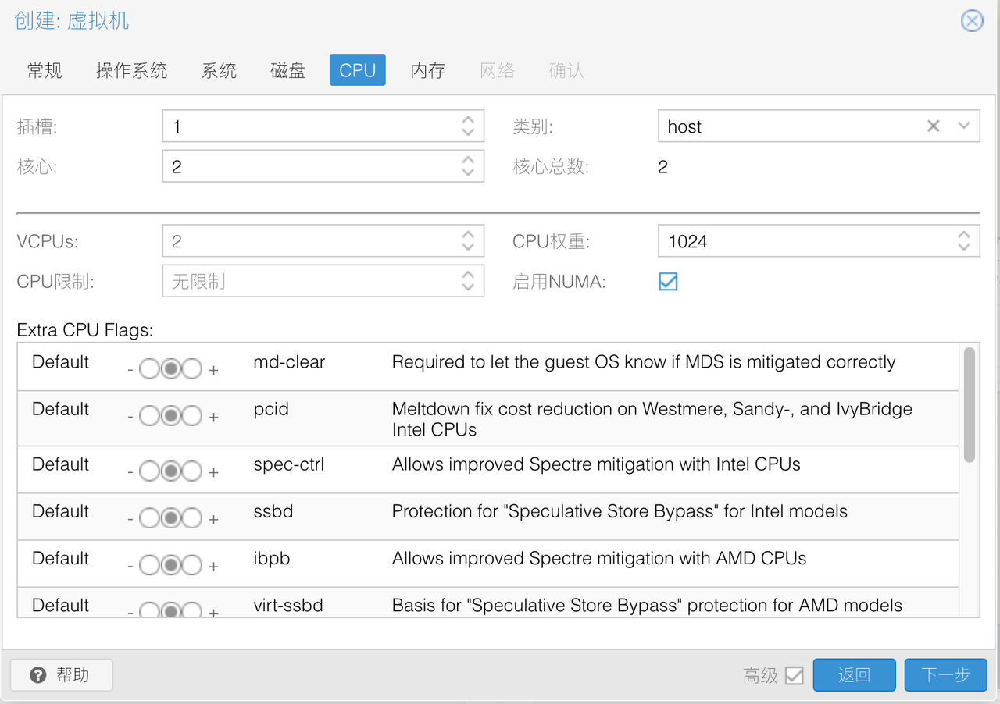

### 1.6.内存

内存一般 2G 足够使用，关闭 `Ballooning` 设备选项：

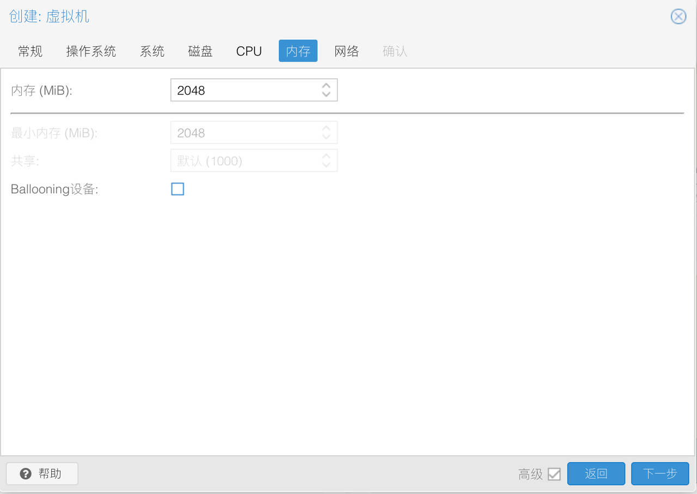

### 1.7.网络

在 PVE 的 [网络设置](./2.PVE初始化配置.md#3配置-pve-网桥和管理网口) 中，曾创建了一个没有桥接任何物理网口的内部网桥。  

并且该网桥接口为主路由 RouterOS 的 LAN 的成员接口。  

因此 Debian 虚拟机的网络设备选择该内部网桥即可，演示环境为 `vmbr4` ： 

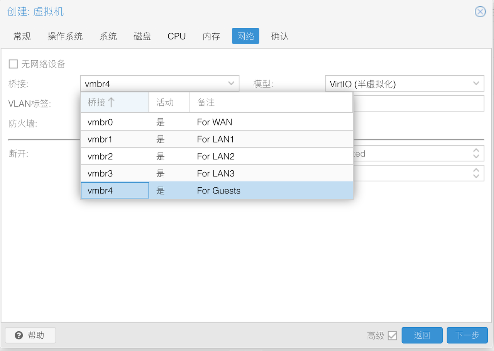

取消网口的 `防火墙` ，并根据虚拟机 vCPU 数，指定 `Multiqueue` 的数量，演示环境为 `2` ：

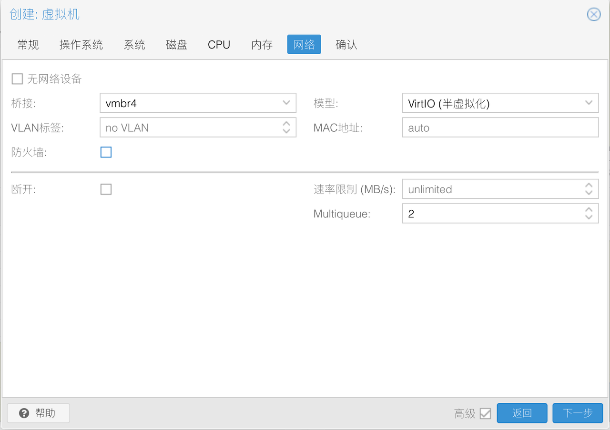

### 1.8.确认

接下来查看设置总览，确认无误，即可点击 “完成” ：


## 2.调整虚拟机硬件参数

### 2.1.删除虚拟机光驱

此时，查看虚拟机详情页，可以看到我们刚才创建的 Debian 虚拟机，删除 `CD/DVD驱动器` ：


### 2.2.虚拟机导入磁盘镜像

使用 SSH 工具登录 PVE 服务器，并进入 `tmp` 目录，逐条执行以下命令来创建一个文件夹：

```bash
# 进入 tmp 目录
cd /tmp

# 创建文件夹
mkdir Debian

# 进入文件夹
cd Debian
```

将 Debian 云镜像 `debian-11-genericcloud-amd64.qcow2` 上传到该文件夹中，并检查 `hash` ：

```bash
# 检查文件是否存在
ls -la

# 计算文件 hash
sha512sum debian-11-genericcloud-amd64.qcow2
```

确认无误后，将 Debian 云镜像导入刚才创建的虚拟机中，命令中的 `VM ID` 需要根据实际情况替换，演示为 `1000` ：

```bash
# 将 qcow2 镜像导入虚拟机中
qm importdisk 1000 debian-11-genericcloud-amd64.qcow2 local-lvm

# 输出结果为以下类似内容表示成功
Successfully imported disk as 'unused0:local-lvm:vm-1000-disk-1'  
```

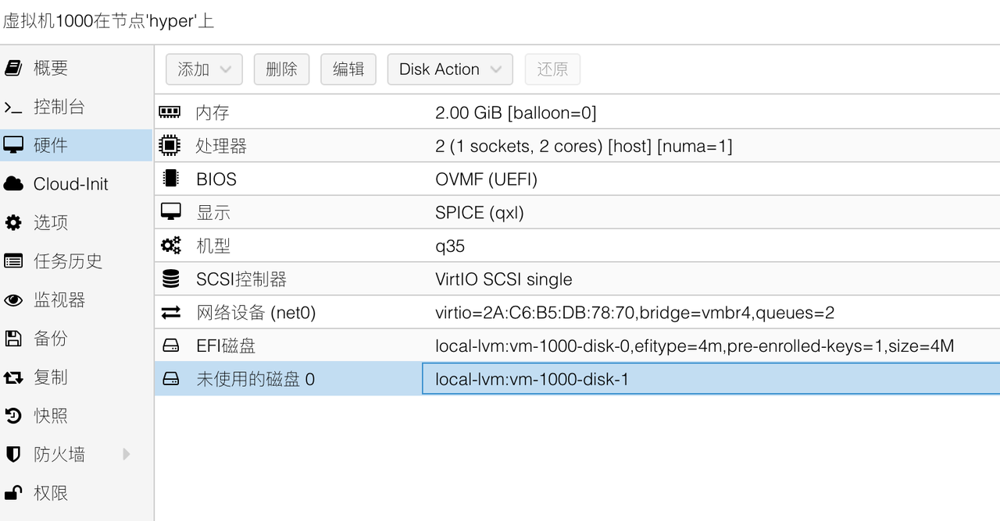

鼠标 **双击** 该未使用的磁盘，勾选 `IO thread` ，点击添加按钮：

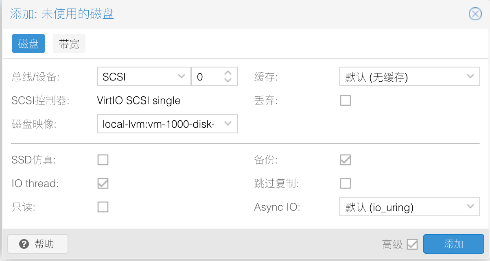

刚导入的磁盘只有 `2G` 磁盘空间，为了后续方便使用，先给磁盘扩容 `16G` 的磁盘空间。  

鼠标 **单击** 选中该磁盘，选择页面顶部 `Disk Action` 菜单的子菜单 `Resize` ：

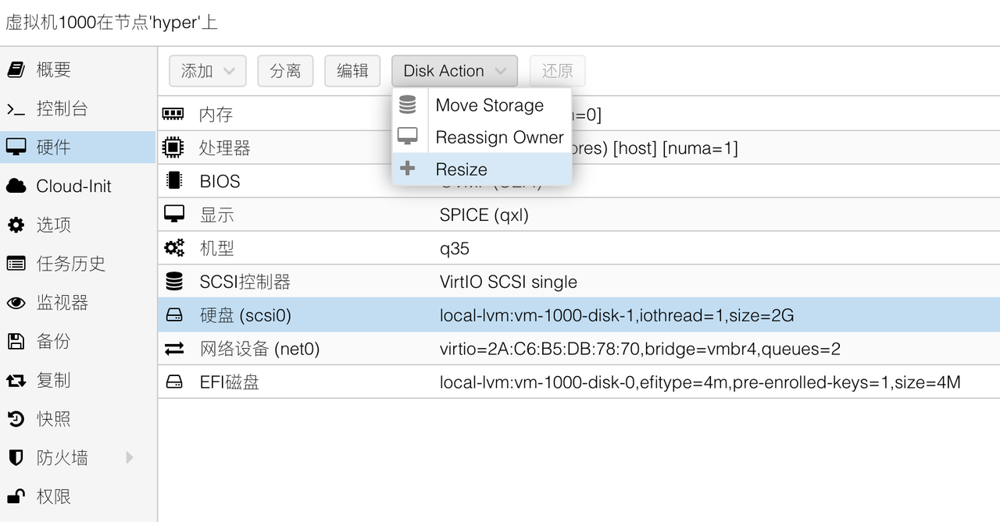

在弹出的对话框中，给该磁盘增加 `16G` 磁盘空间：

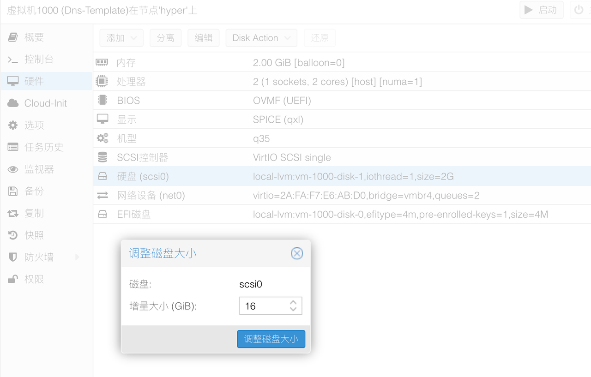

### 2.3.虚拟机添加CloudInit设备

为了能够正确使用 Cloud-Init 初始化系统，需要给 Debian 虚拟机添加 `CloudInit设备` 。  

点击顶部 `添加` 按钮，选择 `CloudInit设备` ：

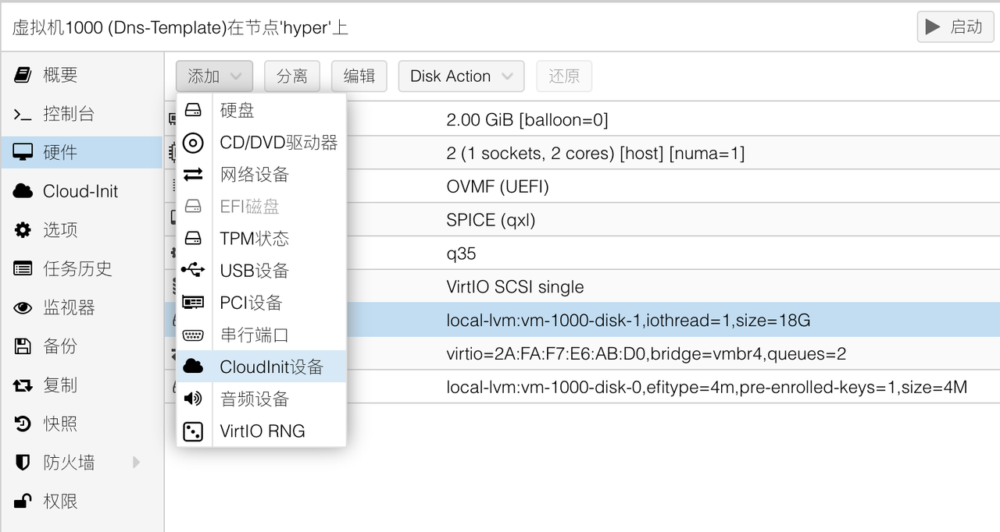

`总线/设备` 选择 `SCSI` ，编号为 `1` ，存储选择 `local-lvm` ：

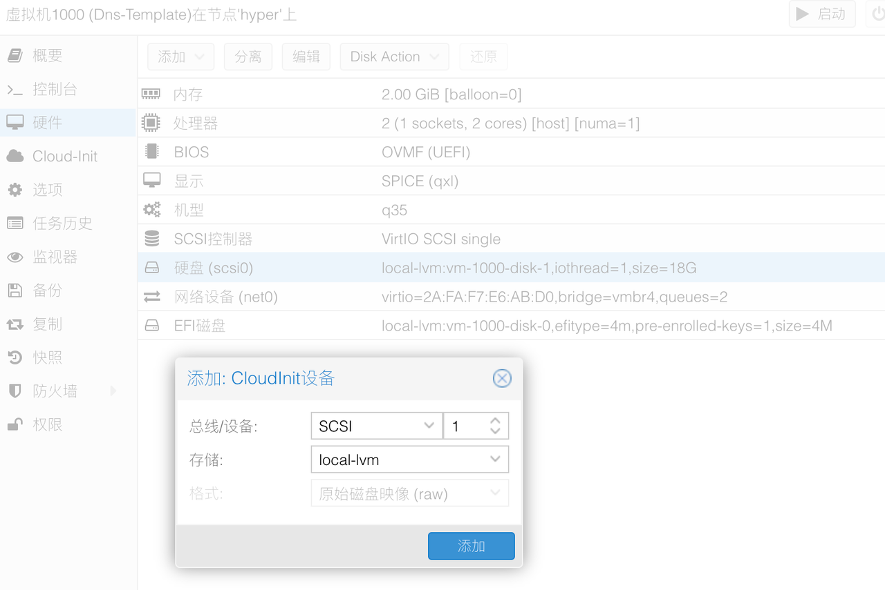

### 2.4.虚拟机添加串行端口

有些云镜像需要用到 `serial` 端口作为视频输出端口，不然虚拟机无法启动，因此给 Debian 虚拟机添加串行端口。

点击顶部 `添加` 按钮，选择 `串行端口` ：

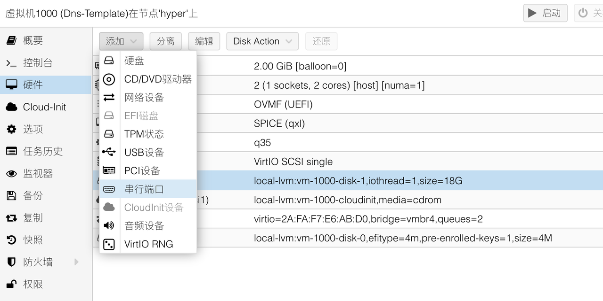

串行端口编号为 `0` ：

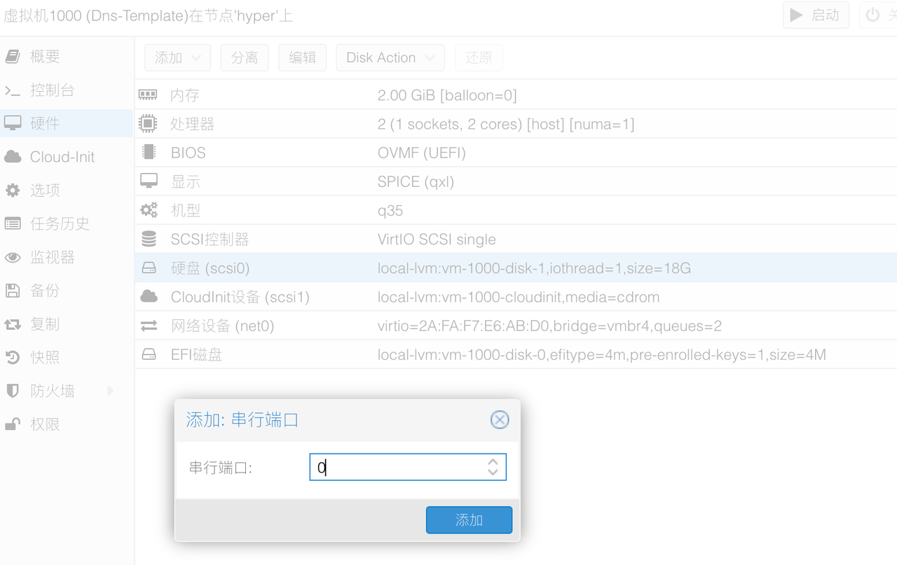

虚拟机硬件设备修改完成后，如下图所示：

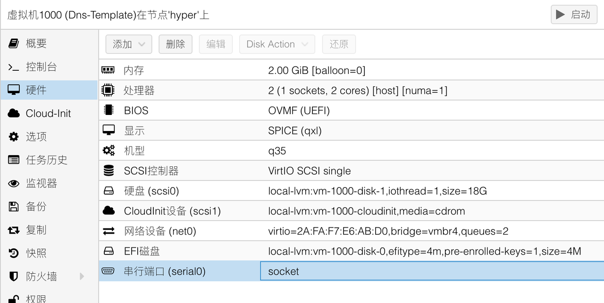

## 3.调整虚拟机配置参数

进入左侧虚拟机 `选项` 菜单，可以看到当前虚拟机的配置参数。  

通常情况下，Debian 虚拟机的配置参数需要修改以下几个：

1. 开机自启动（模板无需修改，克隆的虚拟机需要修改）
2. 启动/关机顺序（模板无需修改，克隆的虚拟机需要修改）
3. 引导顺序（仅模板需要修改）
4. 使用平板指针（仅模板需要修改）

### 3.1.修改引导顺序

鼠标 **双击** `引导顺序` 选项，进入编辑界面。  

在 `scsi0` 设备处，勾选前面的 “已启用” 复选框，并使用行首的排序功能，将该设备拖拽到第一个。  

然后点击 `OK` 按钮：  

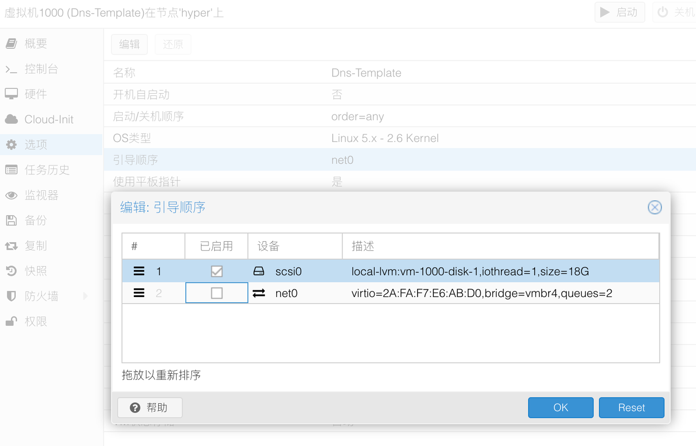

### 3.2.修改平板指针设置

关闭 `使用平板指针` 选项，可以一定程度上降低虚拟机的 CPU 使用率。  

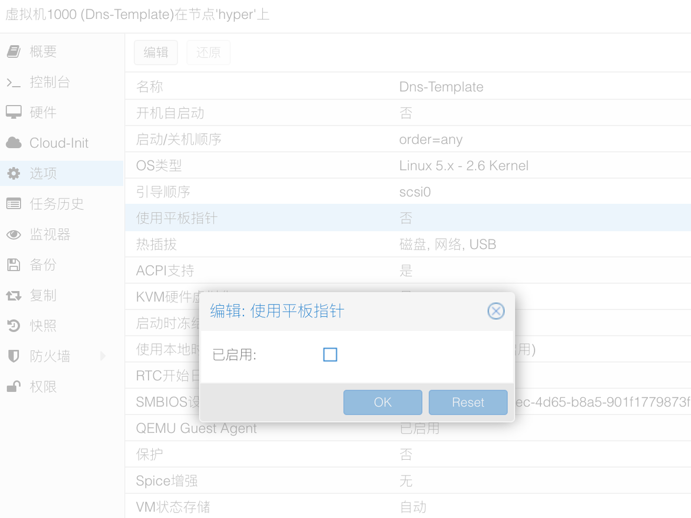

## 4.设置Cloud-Init

进入左侧虚拟机 `Cloud-Init` 菜单，可以看到当前虚拟机的初始化参数。  

根据之前的网络规划，内网的 IP 地址段为 `172.16.1.0/24` ，因此 Debian 虚拟机模板的参数如下：

|参数|值|说明|
|--|--|--|
|用户|fox|新系统的管理员账户|
|密码|********|使用强密码|
|DNS域|fox.lab|内网域名（可选）|
|DNS服务器|`172.16.1.1 fc00::1`|本机DNS服务器，用空格隔开|
|SSH公钥|无|使用秘钥登录服务器，暂不使用|
|IP配置(net0)|`ip=172.16.1.240/24,gw=172.16.1.1,ip6=fc00::f0/64`|模板的 IP 设置|

 **说明：**   

修改 `Cloud-Init` 参数时，需要在虚拟机关机情况下修改才会生效。  

在 `DNS服务器` 设置部分，如果先设置了 `127.0.0.1` 作为虚拟机 DNS 服务器，后续其他 DNS 的 IP 地址将被虚拟机忽略。  

此时内网没有其他 DNS 服务器存在，因此 `DNS服务器` 先设置为 `172.16.1.1 fc00::1` ，IP 之间用空格隔开。  

在使用 Debian 模板克隆出新虚拟机之后，再对新虚拟机调整 IP 设置比较好。  

`Cloud-Init` 的 `IP配置` ，如下图所示：

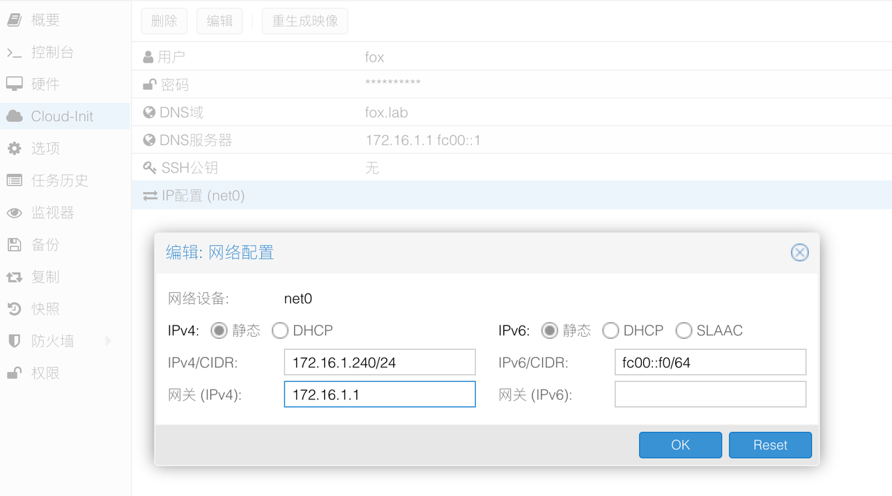

设置完成后，Debian 虚拟机必要参数全部设置完成，可以将该虚拟机开机。